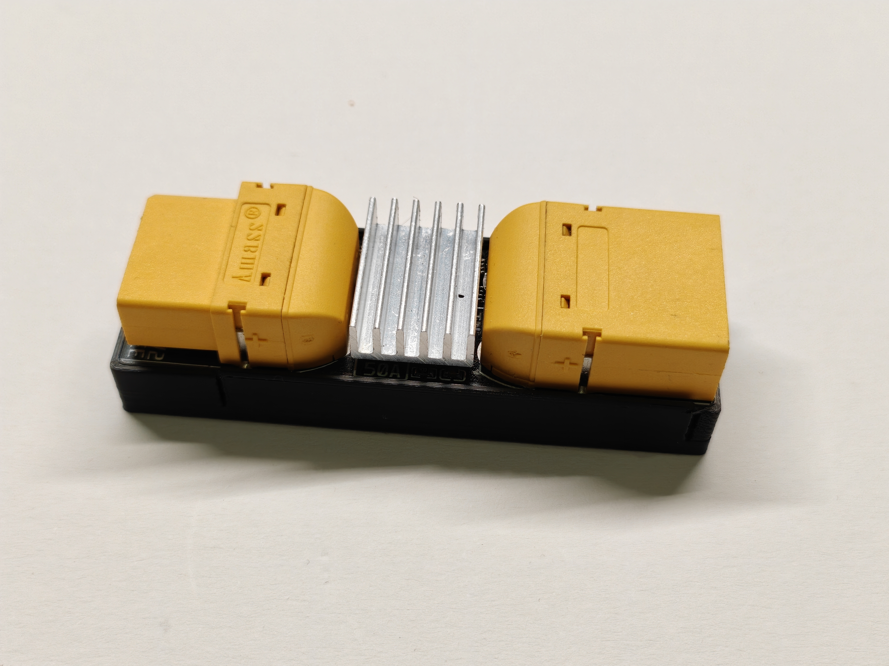

# XT90 Power Meter

Precision high-current power meter with electronic fuse (eFuse), PWM dimmer and constant-current / constant-power regulation, built around an ESP32-S3 and the INA228 shunt monitor. Designed for continuous currents up to 50 A.

The device measures voltage, current, power and temperature in real time, switches the load through two N-channel MOSFETs, and provides a complete web interface plus a 100 Hz JSON serial telemetry stream.

<!-- HERO IMAGE -->
<p align="center">

</p>

---

## Table of Contents

- [Features](#features)
- [Hardware](#hardware)
- [Repository Structure](#repository-structure)
- [About the Software](#about-the-software)
- [Disclaimer](#disclaimer)
- [Getting Started](#getting-started)
- [Usage](#usage)
- [Safety](#safety)
- [Contributing](#contributing)
- [License](#license)

---

## Features

### Live Measurement

- 100 Hz sensor sampling (INA228, 4x averaging, ~550 Hz internal conversion)
- WebSocket live stream at ~77 Hz
- Voltage, current, power and die temperature
- Energy counter (Wh), uptime, peak and minimum values
- Embedded live chart with zoom controls, freeze mode and PNG export

### Electronic Fuse (eFuse)

- Limits: max current, max voltage, min voltage, max temperature
- Configurable trip delay (software time-based fuse)
- Trip report with fault reason, fault values and output runtime before the trip
- Reset via web interface, serial console, or long-press of the boot button
- MOSFETs off on boot; output state fully software-controlled

### PWM Dimmer

- 10-bit PWM output, frequency configurable from 100 Hz to 30 kHz
- Smooth gauge and live slider in the web interface
- Closed-loop regulators: constant current (CC) and constant power (CP) via P-controller

### Data Logger

- CSV logging to SPIFFS, up to ~65,000 entries
- Log interval configurable from 0.1 s to 3600 s
- Every entry carries the min/peak values recorded during its interval
- Progressive browser-based Excel/CSV export with progress indicator
- Restart events are written into the log

### Calibration

- Browser-based two-step calibration wizard (reference value vs. raw value)
- Separate calibration factors for voltage and current, stored in EEPROM

### System

- Self-hosted WiFi access point (configurable SSID/password)
- mDNS (`meter.local`) when enabled
- IIR smoothing filters for voltage and current
- Configurable status LED (brightness, on/off), boot button enable
- Default-output and auto-logging behavior on boot
- Full settings persistence in EEPROM with CRC16 validation
- UI languages: German / English

---

## Hardware

### Overview

| Component       | Part                         | Function                     |
| --------------- | ---------------------------- | ---------------------------- |
| Microcontroller | ESP32-S3-MINI-1-N8           | WiFi AP, web server, control |
| Measurement IC  | INA228 (TI, VSSOP-10)        | 20-bit shunt monitor, I2C    |
| Shunt           | 0.5 mOhm (5930 package)      | Current sensing up to 50 A   |
| Power MOSFETs   | 2x CMSL012N10 (TOLL)         | Load switch                  |
| Gate driver     | UCC27517A (SOT-23-5)         | MOSFET gate drive            |
| Buck 12 V       | LM5164 (SO-8)                | Input supply from VIN        |
| Buck 3.3 V      | TPS629206 (SOT-583)          | MCU / sensor supply          |
| Input           | XT90PW panel-mount connector | VIN                          |
| Output          | XT90PW cable connector       | VOUT                         |
| USB-C           | 16-pin                       | Programming / serial console |

The board accepts a single supply rail (VIN) and generates 12 V and 3.3 V on board. The load is switched on the low side by two paralleled TOLL MOSFETs driven by a dedicated gate driver.

### Pinout (ESP32-S3)

| Pin             | Function                                  |
| --------------- | ----------------------------------------- |
| GPIO 0          | Boot button (active low)                  |
| GPIO 4          | PWM output (dimmer, 10-bit)               |
| GPIO 5          | Status LED (PWM)                          |
| GPIO 8 / GPIO 9 | I2C SDA / SCL (INA228, 400 kHz)           |
| GPIO 10         | INA228 ALERT (reserved, currently unused) |

### Schematic, PCB and Assembly

All hardware files are located in the `PCB/` folder:

| Document            | File                                        |
| ------------------- | ------------------------------------------- |
| Schematic           | `PCB/schematic.pdf`                         |
| Gerber files        | `PCB/gerber.zip` (RS-274X)                  |
| Bill of materials   | `PCB/bom.xlsx` (LCSC part numbers included) |
| Pick and place      | `PCB/pick.xlsx`                             |
| 3D model of the PCB | `PCB/3d_model.step`                         |

### Enclosure

The 3D-printable enclosure is included as a 3MF file directly in the repository root. It snaps onto the PCB edge without screws and provides openings for both XT90 connectors, the USB-C port and the status LED.

| Property       | Recommendation               |
| -------------- | ---------------------------- |
| File           | `Case.3mf` (repository root) |
| Material       | PETG or ABS                  |
| Print settings | 3 perimeters, 40 % infill    |

---

## Repository Structure

```javascript
.
├── Firmware/                   PlatformIO project (ESP32-S3)
│   ├── platformio.ini          Board config, libraries, build flags
│   ├── partitions_8mb.csv      Flash layout (3.5 MB app + 4 MB SPIFFS)
│   ├── main.cpp                Main program
│   └── include/                All firmware modules
│       ├── INA228Wrapper.*     Sensor driver, smoothing, calibration
│       ├── WebInterface.*      HTTP/WebSocket, eFuse logic, CC/CP regulator
│       ├── WebPages.*          Web UI pages
│       ├── DataLogger.*        SPIFFS CSV logging, chunked export
│       ├── Settings.*          EEPROM persistence with CRC16
│       ├── StatusLED.*         LED modes (on / breathing / eFuse blink)
│       └── SerialConsole.*     JSON command line, 100 Hz telemetry
├── PCB/
│   ├── gerber.zip              Gerber files (RS-274X)
│   ├── schematic.pdf           Schematic
│   ├── bom.xlsx                Bill of materials (LCSC part numbers)
│   ├── pick.xlsx               Pick and place data
│   └── 3d_model.step           3D model of the PCB
├── Case.3mf                    3D-printable snap-on enclosure
├── images/                     Photos and screenshots
├── LICENSE                     GNU AGPL v3
├── README.md
└── SETUP.md                    Detailed build and setup guide
```

---

## About the Software

A significant portion of the firmware was created with the assistance of generative AI tools. It works and has been tested on real hardware, but it should be seen as a solid starting point rather than a finished, peer-reviewed product.

I am not a professional software developer, and I am happy about every contribution. If you are a software developer and spot weak spots, structural problems or potential bugs - or simply have ideas for new features - please open an issue or a pull request. Constructive criticism is explicitly welcome.

---

## Disclaimer

**This is a private hobby project.**

There is **no guarantee of functionality** - neither for the hardware nor for the firmware. Everything is provided "as is", without any warranty of any kind. I am not an electrical engineer or a professional software developer.

Use this project **entirely at your own risk**. It has been built and tested to the best of my knowledge, but it is not certified, not safety-rated and not intended for any application where failure could cause damage, injury or danger - especially not for safety-critical or unattended high-current operation.

If you build and use this device, you are responsible for verifying that it works correctly in your setup and for complying with all applicable regulations.

---

## Getting Started

The firmware is a complete [PlatformIO](https://platformio.org/) project for Visual Studio Code - board settings, library dependencies and the flash partition table are all defined in `platformio.ini`, no manual library installation required.

The short version:

1. Install [Visual Studio Code](https://code.visualstudio.com/) with the [PlatformIO IDE extension](https://platformio.org/platformio-ide).
2. Open the `Firmware/` folder as a PlatformIO project and upload it to the board (Upload button in the PlatformIO toolbar or `pio run --target upload`).
3. Power the board through the XT90 input.
4. Connect to the WiFi access point (default SSID `XT90_PowerMeter`, password `12345678`).
5. Open `http://192.168.4.1` or `http://meter.local` in a browser.

Full details: [SETUP.md](SETUP.md)

---

## Usage

### Web Interface

Connect to the access point and open `http://192.168.4.1` or `http://meter.local` (with mDNS enabled).

| Page         | Content                                               |
| ------------ | ----------------------------------------------------- |
| `/`          | Live view: readings, chart, output switch             |
| `/logger`    | Peaks/minimums, energy, logging control, Excel export |
| `/efuse`     | Limits, trip report, reset                            |
| `/dimmer`    | Dimmer slider, CC/CP regulator, gauge                 |
| `/config`    | WiFi, PWM, smoothing, LED, button, logger, language   |
| `/calibrate` | Calibration wizard                                    |

### Serial Console

USB-CDC at 2,000,000 baud. Continuous JSON telemetry at 100 Hz and a status frame every 5 s. Commands are sent as JSON lines, for example:

```json
{"cmd":"status"}
{"cmd":"get"}
{"cmd":"set","key":"maxCurrent","value":25}
{"cmd":"output","value":1}
{"cmd":"dimmer","value":50}
{"cmd":"dimmeren","value":1}
{"cmd":"logging","value":1}
{"cmd":"efuse","value":1}
{"cmd":"resetefuse"}
{"cmd":"log"}
{"cmd":"logclear"}
{"cmd":"help"}
```

All available setting keys are listed by `{"cmd":"help"}` and `{"cmd":"get"}`.

### Boot Button

- **Short press:** toggle output
- **Long press (> 2 s):** reset eFuse

---

## Safety

- The device is designed for high currents. At 50 A, the 0.5 mOhm shunt dissipates up to 1.25 W; ensure adequate copper area and cooling.
- The eFuse is a software protection function and does not replace a certified fuse.
- Respect the MOSFET voltage and current ratings and provide sufficient cooling for continuous load.
- The output MOSFETs switch on the low side. When the output is off, VOUT remains connected to VIN through the load path.
- Calibrate only with suitable reference instruments.

---

## Contributing

Contributions of any kind are welcome - whether it is:

- bug reports and bug fixes
- code quality and structural improvements
- ideas for new features
- documentation improvements
- hardware feedback from your own build

Please open an issue first for larger changes so we can discuss the direction.

---

## License

This project is licensed under the **GNU Affero General Public License v3.0** - see the [LICENSE](LICENSE) file for details. The hardware design files are provided for reference and manufacturing.

The firmware is distributed in the hope that it will be useful, but WITHOUT ANY WARRANTY. If you run a modified version of this firmware on a network server, the AGPL requires you to make the corresponding source code available to users interacting with it.
